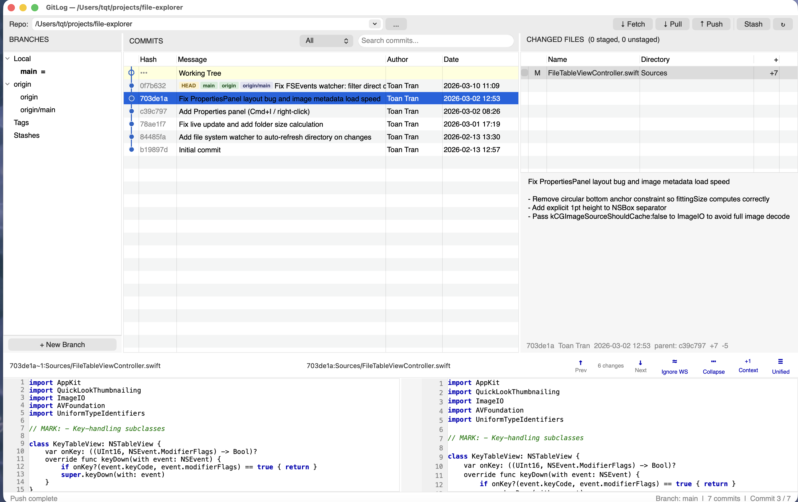
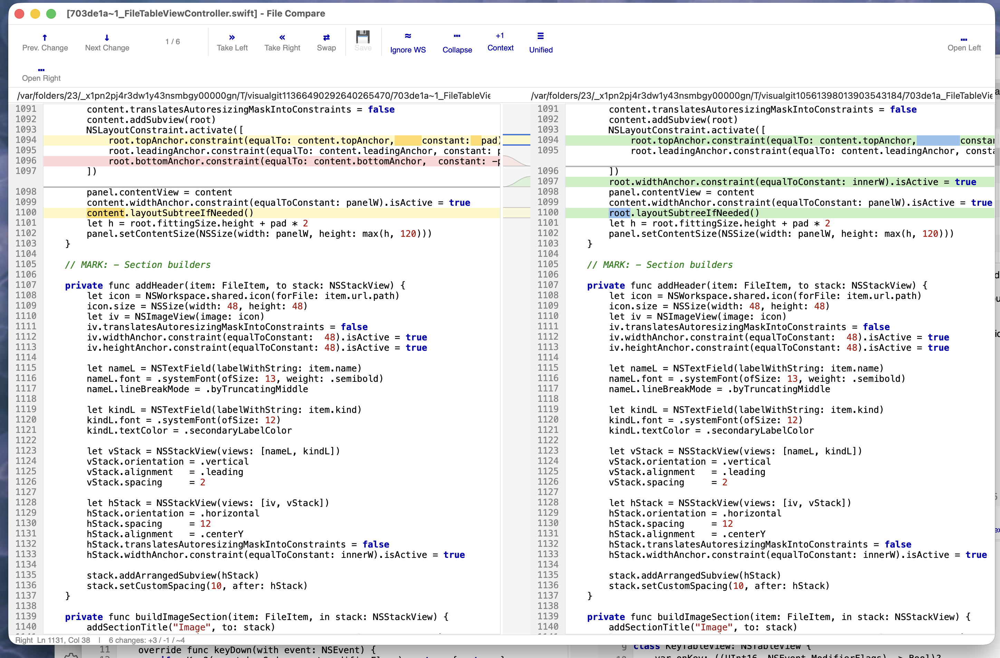

# visual-git

A lightweight Git GUI built with Java and Eclipse SWT, inspired by SmartGit.



## Features

### GitLog — Git commit browser
- Branch sidebar with Local, Remote, Tags, Stashes
- Commit log with inline branch/tag labels, filterable by message/author/hash
- Working tree support with staged/unstaged file sections
- Stage/unstage/commit workflow with amend support
- Branch operations: create, checkout, delete, rename, merge
- Stash operations: push, pop, apply, drop
- Commit context menu: cherry-pick, revert, reset, squash, copy hash
- Fetch/Pull/Push with multiple remote support
- Embedded diff panel for quick file preview

### FileCompare — Side-by-side diff viewer



- Myers diff algorithm for line-level change detection
- Inner-line change highlighting with token-level LCS diff
- Aligned equal sections with 1:1 scroll sync
- Syntax highlighting for C++/Java/Swift
- Bezier-curve gutter connecting changed blocks
- Prev/Next navigation and merge operations (Take Left / Take Right)
- Unified view mode

### FolderCompare — Directory comparison
- Side-by-side file list with color-coded status
- Double-click to open FileCompare for any file pair

## Requirements

- Java 17+ (developed with JDK 25)
- Eclipse SWT library (platform-specific, not included)

## SWT Setup

Download the correct SWT JAR for your platform from [Eclipse SWT](https://www.eclipse.org/swt/) and place it at `lib/swt.jar`.

| Platform | SWT JAR |
|----------|---------|
| macOS (ARM/M1) | `swt-4.x-cocoa-macosx-aarch64.jar` |
| macOS (Intel) | `swt-4.x-cocoa-macosx-x86_64.jar` |
| Windows (x64) | `swt-4.x-win32-win32-x86_64.jar` |
| Linux (x64) | `swt-4.x-gtk-linux-x86_64.jar` |

## Build & Run

```bash
# Build
javac -cp lib/swt.jar -d out src/main/java/com/visualgit/*.java

# Run GitLog (macOS — -XstartOnFirstThread is required)
java -cp out:lib/swt.jar -XstartOnFirstThread com.visualgit.GitLog [repo-path]

# Run FileCompare
java -cp out:lib/swt.jar -XstartOnFirstThread com.visualgit.FileCompare [leftfile] [rightfile]

# Run FolderCompare
java -cp out:lib/swt.jar -XstartOnFirstThread com.visualgit.FolderCompare [leftdir] [rightdir]
```

On Linux, omit `-XstartOnFirstThread`. On Windows, use `;` instead of `:` for classpath.

### macOS .app bundles

```bash
./build-app.sh
# Creates dist/GitLog.app
```

## Keyboard Shortcuts

| Shortcut | Action |
|----------|--------|
| Ctrl+Down | Next Change |
| Ctrl+Up | Prev Change |
| Ctrl+Right | Take Left (copy left to right) |
| Ctrl+Left | Take Right (copy right to left) |
| Ctrl+S | Save |

## Source Files

| File | Description |
|------|-------------|
| `AppTheme.java` | Shared theme: platform detection, fonts, colors |
| `SyntaxHighlighter.java` | Syntax highlighting engine |
| `GitLog.java` | Git commit browser with branches sidebar |
| `FileCompare.java` | Side-by-side diff viewer |
| `FolderCompare.java` | Directory comparison UI |
| `FolderDiff.java` | Directory diff engine |

## Platform Notes

- macOS requires `-XstartOnFirstThread` JVM flag for SWT
- Fonts: Menlo (macOS), Consolas (Windows), Monospace (Linux)
- No build tool (Maven/Gradle) — just raw `javac`
